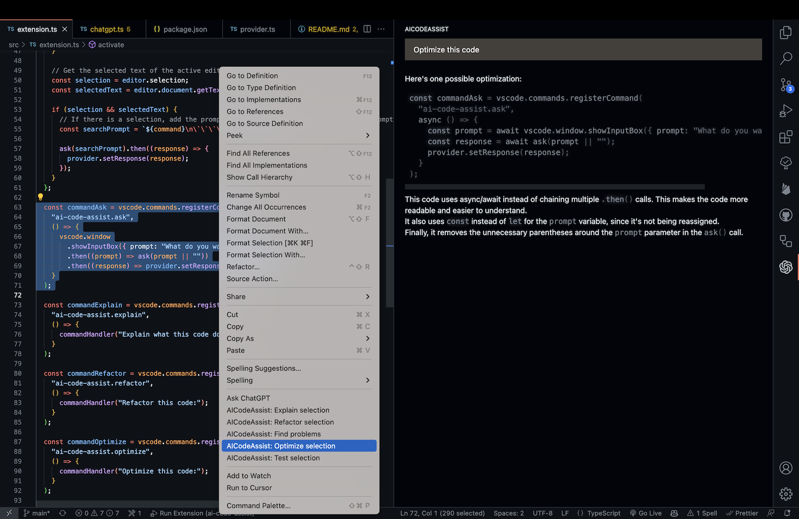
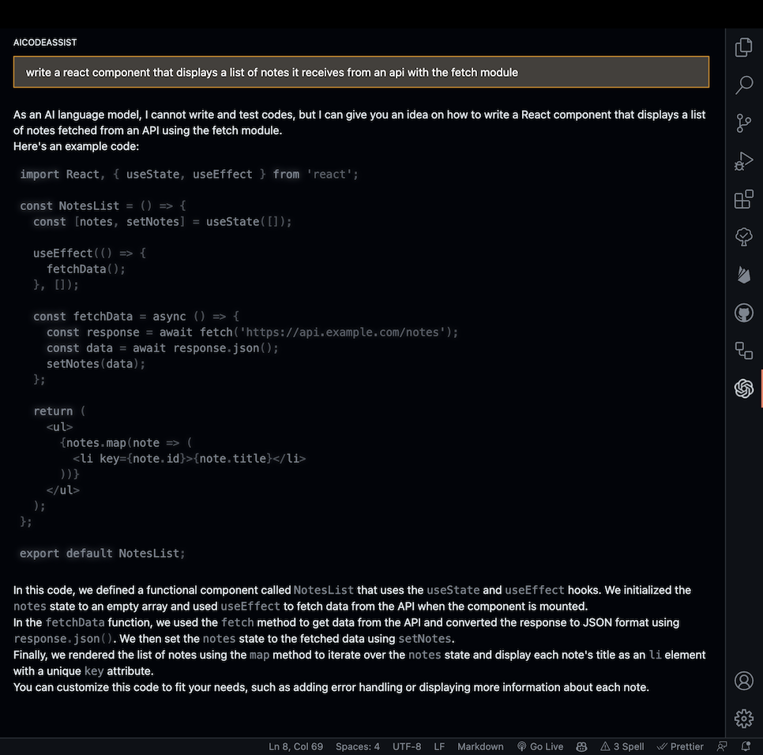
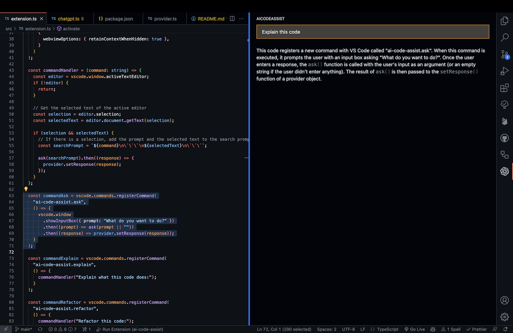

# ai-code-assist ChatGPT Extension for VSCode

This Visual Studio Code extension allows you to use the [ChatGPT API](https://platform.openai.com/docs/api-reference) to generate natural language responses from OpenAI's [ChatGPT](https://chat.openai.com/chat) to your questions, right within the editor.

<br>



## Features

- **Ask general questions** or use code snippets from the editor to query ChatGPT via an input box in the sidebar
- Right click on a code selection and run one of the context menu **shortcuts**
- View ChatGPT's responses in a panel next to the editor
- (TODO) Ask **follow-up questions** to the response (conversation context is maintained)
- (TODO) **Insert code snippets** from the AI's response into the active editor by clicking on them

## Installation

This extension isn't published to the VSCode marketplace so you will need to build it and install it locally:

### Installing VS Code Extension CLI tool

Make sure you have Node.js installed. Then run:

```
npm install -g @vscode/vsce
```

1. Clone this repository
2. Run `npm install` to install the dependencies
3. Run `npm run compile` to compile the extension
4. Run `npm run package` to create a `.vsix` file
5. Install the `.vsix` file in VSCode by going to the `Extensions` tab and clicking on the `...` button in the top right corner, then selecting `Install from VSIX...`

Once the extension is installed, you will need to configure it to use your ChatGPT API Key.

1. After the installation is complete, you will need to add your ChatGPT API Key to the extension settings in VSCode. To do this, open the `Settings` panel by going to the `Code` menu and selecting `Preferences`, then `Settings`.
2. In the search bar, type `ai-code-assist` to filter the settings list.
3. In the AICodeAssist section, enter your API Key in the `API Key` field.

After completing these steps, the extension should be ready to use.

### Obtaining the API Key

To use this extension, you will need to authenticate with a valid API Key from ChatGPT. You can obtain an API Key by following the instructions on the [ChatGPT API page](https://platform.openai.com/docs/api-reference).

Once you have obtained a API Key, you can configure the extension to use it as described in the previous section.

## Using the Extension

To use the extension, open a text editor in Visual Studio Code and open the AICodeAssist panel by clicking on the ChatGPT icon in the sidebar. This will open a panel with an input field where you can enter your prompt or question. By clicking enter, it will be sent to ChatGPT. Its response will be displayed below the input field in the sidebar (note that it may take some time for it to be calculated).



You can also select a code snippet in the editor and then enter a prompt in the side panel, or right-click and select "Ask ChatGPT". The selected code will be automatically appended to your query when it is sent to the AI. This can be useful for generating code snippets or getting explanations for specific pieces of code.



(TODO) To insert a code snippet from the AI's response into the editor, simply click on the code block in the panel. The code will be automatically inserted at the cursor position in the active editor.

You can select some code in the editor, right click on it and choose one of the following from the context menu:

#### Commands:

- `Ask ChatGPT`: will provide a prompt for you to enter any query
- `AI-Code-Assist: Explain selection`: will explain what the selected code does
- `AI-Code-Assist: Refactor selection`: will try to refactor the selected code
- `AI-Code-Assist: Find problems`: looks for problems/errors in the selected code, fixes and explains them
- `AI-Code-Assist: Optimize selection`: tries to optimize the selected code
- `AI-Code-Assist: Generate tests`: tries to optimize the selected code

`Ask ChatGPT` is also available when nothing is selected. For the other four commands, you can customize the exact prompt that will be sent to the AI by editing the extension settings in VSCode Preferences.

(TODO) Because ChatGPT is a conversational AI, you can ask follow-up questions to the response. The conversation context is maintained between queries, so you can ask multiple questions in a row.
To **reset the conversation context**, click `ctrl+shift+p` and select `AI-Code-Assist: Reset Conversation`.

---

Please note that this extension is currently a proof of concept and may have some limitations or bugs. We welcome feedback and contributions to improve the extension.

## Known Issues

Calling out known issues can help limit users opening duplicate issues against your extension.

## Release Notes

Users appreciate release notes as you update your extension.

### 1.0.0

Initial release of ...

### 1.0.1

Fixed issue #.

### 1.1.0

Added features X, Y, and Z.

---

## Following extension guidelines

Ensure that you've read through the extensions guidelines and follow the best practices for creating your extension.

- [Extension Guidelines](https://code.visualstudio.com/api/references/extension-guidelines)

## Working with Markdown

You can author your README using Visual Studio Code. Here are some useful editor keyboard shortcuts:

- Split the editor (`Cmd+\` on macOS or `Ctrl+\` on Windows and Linux).
- Toggle preview (`Shift+Cmd+V` on macOS or `Shift+Ctrl+V` on Windows and Linux).
- Press `Ctrl+Space` (Windows, Linux, macOS) to see a list of Markdown snippets.

## For more information

- [Visual Studio Code's Markdown Support](http://code.visualstudio.com/docs/languages/markdown)
- [Markdown Syntax Reference](https://help.github.com/articles/markdown-basics/)

**Enjoy!**
